# Express Keys
<p align="center">


# Descripción de la web 🌐
ExpressKeys consiste en una web de compra de "keys" de videojuegos para las diferentes plataformas online del mercado. En ella el cliente puede buscar los diferentes títulos disponibles utilizando diferentes herramientas como por ejemplo un sistema de filtrado por categorías, por precio, por plataforma online, etc... para posteriormente comprarlo y recibir su código para canjearlo.


# Entidades 🗯
 * Clientes: Usuarios del sistema que compran las keys en la página web.
 * Administradores: Usuario o usuarios que se encargan de añadir o eliminar productos del catalogo de la tienda.
 * Producto: Son las keys de los videojuegos que se muestran en la tienda y el usuario puede comprar.
 * Carrito de la compra: Los usuarios pueden añadir una o varias keys a una cesta de la compra antes de adquirirlas.
 * Valoraciones: Tras comprar una key un usuario puede dejar una puntuacion a la compra o revisar la valoración de otros productos,

# Parte pública 🔓
* Busqueda de videojuegos
* Filtrar catálogo
* Comprar keys
* Logearse/Registrarse 

# Parte privada 🔐
* Añadir/Eliminar productos del catalogo
* Dar de baja/alta a usuarios
* Consultar información de usuarios.

# Servicio interno 🖥
El servicio interno de Express Keys es el encargado de recoger la lista de productos de una compra para el envío por correo electrónico del ticket de compra con los productos, sus keys y precios a la dirección de correo del cliente. 

La forma que tiene de comunicarse con la aplicación web es mediante colas de mensajes a través del broker de mensajería RabbitMQ.

En el momento de realizar una compra, la web envía un mensaje formado por el ticket de compra y la dirección del cliente a una cola del broker donde es consumido al momento por el SI, que permanece a la escucha de los mensajes que entran en la cola. Una vez recibido el mensaje, el SI separa el mensaje para obtener el ticket y la dirección, formula el correo, lo envía a la dirección del cliente y vuelve a permanecer atento a futuras peticiones hasta que se detenga su ejecución o pierda la conexión con RabbitMQ.

# Integrantes 👥 

* Sergio García Rosell [s.garciaro.2017@alumnos.urjc.es] https://github.com/SergioGr8
* Álvaro Barrio Luquero [a.barrio.2017@alumnos.urjc.es] https://github.com/alv4rob
* Nerfi Salim Perello [n.salim.2017@alumnos.urjc.es] https://github.com/nerf7

# Capturas de pantalla 
* Página principal: Como página principal, se muestra tanto el catálogo completo de productos junto a los filtros de búsqueda, además de los enlaces de registro e inicio de sesión.
<p align="center">

  
* Registro: La página de registro de usuarios incluye los campos para introducir un nombre de usuario, una contraseña y un correo electrónico, los campos que conforman a un usuario.
<p align="center">


* Usuario registrado: Pantalla de aviso de que un nuevo usuario ha sido registrado. Lleva de vuelta a la Página principal.
<p align="center">

  
* Inicio de sesión: Se trata de la pantalla que recibe los datos de login de un usuario para que pueda iniciar sesión.
<p align="center">


* Página principal (logged): Página principal una vez se ha iniciado sesión correctamente. Es como la pantalla Página principal, pero permite acceder a la Página del carrito y a la Página de usuario. Para administradores, permite acceder a la pantalla Admin.
<p align="center">
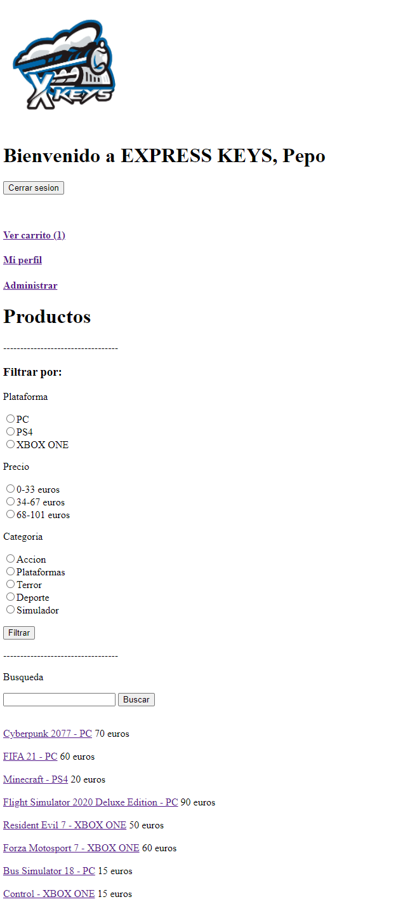

* Login error: Pantalla de aviso de que el usuario y contraseña introducidos no pertenecen a ningún usuario registrado. Permite volver a la pantlla de Inicio de sesión.
<p align="center">
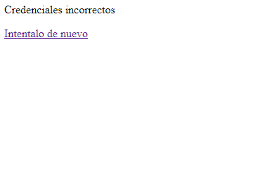

* Admin: Pantalla exclusiva para administradores que permite mostrar la pantalla de Lista de usuarios, Nuevo producto o volver a la Página principal (logged).
<p align="center">
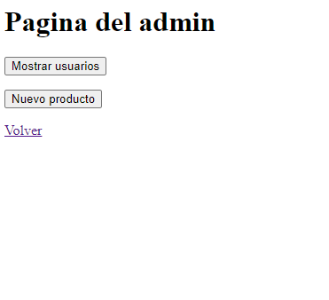

* Perfil: Pantalla que muestra los datos del usuario en la sesión.
<p align="center">
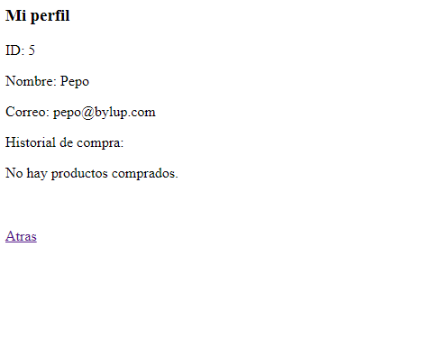
  
* Lista de usuarios: Como opción para los administradores, contiene la lista de los usuarios registrados actualmente y sus roles. Permite acceder a la página de cada usuario o volver a la Página principal (logged).
<p align="center">

  
* Página de usuario: Página exclusiva de administradores que muestra los datos de un usuario y da la opción de eliminarlo de la base de datos.
<p align="center">

  
* Usuario eliminado: Pantalla de aviso de que un usuario ha sido eliminado. Lleva de vuelta a la Lista de usuarios.
<p align="center">

  
* Nuevo producto: Se trata de la página de inserción de usuarios al catálogo. Incluye los campos para introducir una lista de keys, un título, un precio, una plataforma y una categoría, los campos que conforman un producto.
<p align="center">

  
* Producto guardado: Pantalla de aviso de que un nuevo producto ha sido guardado en la base de datos. Lleva de vuelta a la Página principal.
<p align="center">

  
* Página de producto: Muestra la información de un producto y da la opción de añadirlo al carrito, dejar una valoración o volver a la página principal. Como opción para los administradores, está la posibilidad de eliminar el producto de la base de datos y poder ver las keys que quedan del producto.
<p align="center">

  
* Añadido al carrito: Pantalla de aviso de que un producto ha sido añadido al carrito. Lleva de vuelta a la Página principal.
<p align="center">

  
* No ñadido al carrito: Pantalla de aviso de que un producto no ha sido añadido al carrito. Lleva de vuelta a la Página principal.
<p align="center">


* Producto eliminado: Pantalla de aviso de que un producto ha sido eliminado de la base de datos. Lleva de vuelta a la Página principal.
<p align="center">

  
* Introducción de valoración: Pantalla en la que añadir el nombre y contenido de una valoración para un producto.
<p align="center">
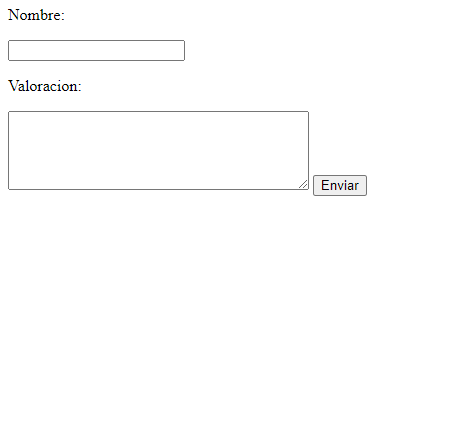 

* Valoración enviada: Pantalla de aviso de que una valoración ha sido registrada. Lleva de vuelta a la Página de producto.
<p align="center">
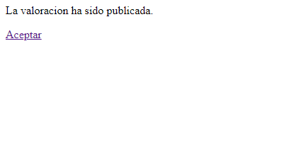
  
* Página del carrito: Pantalla que contiene los productos que se encuentran en el carrito en un momento dado junto a la suma total a pagar. Permite volver a la Página principal o acceder a comprar.
<p align="center">

  
* Compra finalizada: Pantalla de aviso de que la compra ha sido completada. Se adjunta un recibo con los productos comprados y su key. Lleva de vuelta a la Página principal.
<p align="center">


* Error compra: Pantalla de aviso de que ocurrió un error al procesar la compra. El carrito se mantendrá como estaba. Lleva de vuelta a la Página principal (logged).
<p align="center">


# Diagrama de navegación

Una vez vista cada una de las pantallas, a continuación se adjunta el diagrama de navegación de las mismas:
<p align="center">
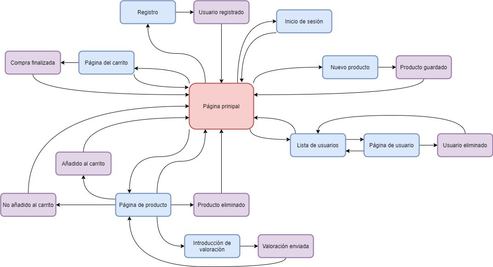
  
# Diagrama Entidad Relación
<p align="center">
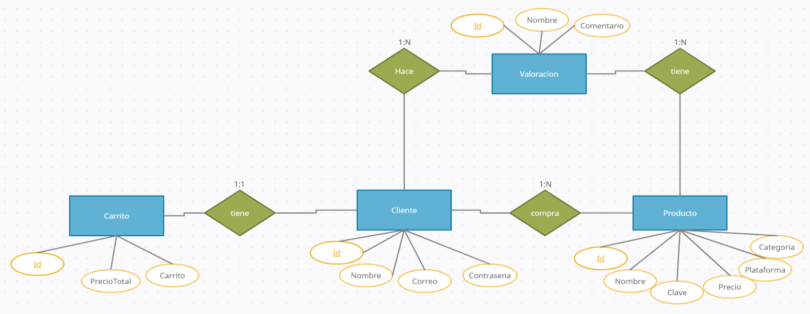

# Diagrama UML
Adjuntamos una imagen con el diagrama UML (actualizado):
<p align="center">
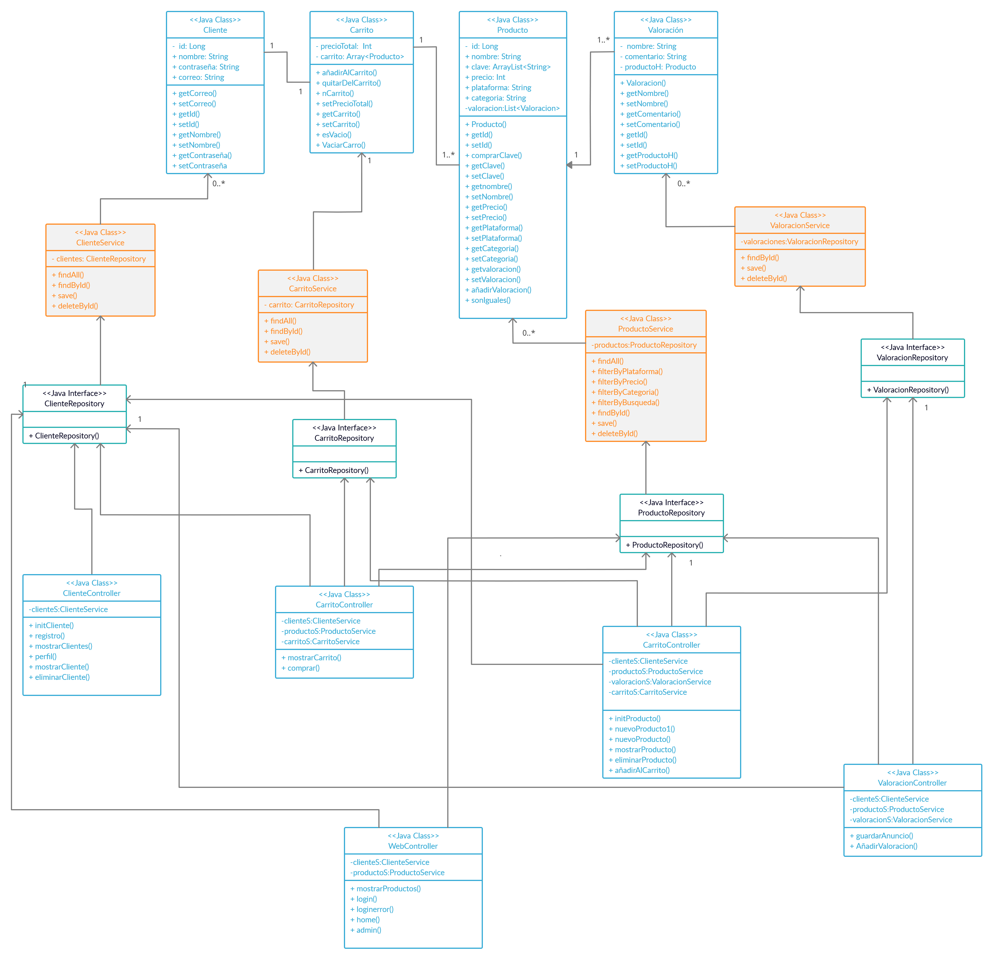

# Diagrama de Clases y templates
Adjuntamos aquí el diagrama de clases y templates:
<p align="center">
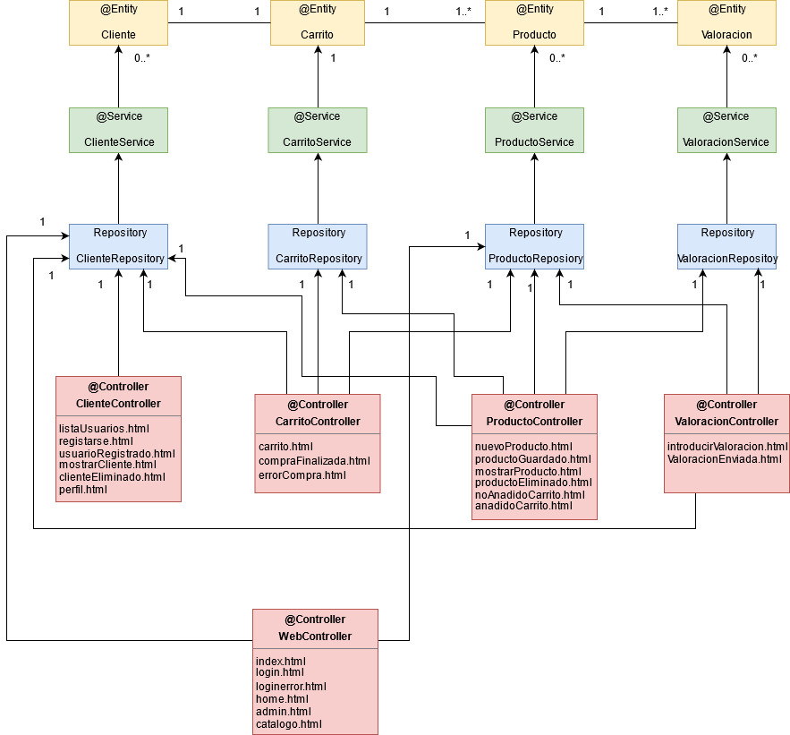

# Instrucciones de instalación 

Para desplegar la aplicación sobre Windows 10, además de acceso a internet, se necesita instalar antes en la máquina:

- Java 8
- RabbitMQ 3.8.11
- MySQL 8.0.23

## Java 8

Java 8 es la versión de Java utilizada tanto por la aplicación web como por el servicio interno.

Pasos para instalar Java 8:

1º. Ve a la página de descarga https://www.java.com/es/download/windows_manual.jsp , elige el archivo de instalación “Windows En línea” y descárgalo.

2º. Ejecuta el archivo recién descargado y selecciona “Instalar”. Una vez finalizada la instalación, selecciona “Cerrar”.

## RabbitMQ 3.8.11

RabbitMQ es el broker de mensajería que utiliza la aplicación web para comunicarse con el servicio interno. Para facilitar la instalación de RabbitMQ, se hará vía Chocolatey.

Pasos para instalar Chocolatey:

1º. Abre Windows PowerShell como administrador.

2º. Ejecuta el siguiente comando para evitar la política de ejecución y confirma con “S”.
```bash
Set-ExecutionPolicy AllSigned
```

3º. Ejecuta el siguiente comando para descargar e instalar Chocolatey.
```bash
Set-ExecutionPolicy Bypass -Scope Process -Force; [System.Net.ServicePointManager]::SecurityProtocol = [System.Net.ServicePointManager]::SecurityProtocol -bor 3072; iex ((New-Object System.Net.WebClient).DownloadString('https://chocolatey.org/install.ps1'))
```

Pasos para instalar RabbitMQ:

1º. Abre Windows PowerShell como administrador.

2º. Ejecuta el siguiente comando para descargar e instalar RabbitMQ y confirma con “Y” las veces necesarias. Permite el acceso de red a las aplicaciones que lo soliciten a través del Firewall de Windows durante la instalación. 
```bash
choco install rabbitmq
```

## MySQL 8.0.23

MySQL es la base de datos utilizada por la aplicación web.

Para instalar MySQL y todas sus herramientas correctamente primero hay que instalar Microsot Visual C++ 2019 Redistributable Package (x64), para instarlarlo se realizaran los siguientes pasos:

1º. Entrar en este enlace para descargar Microsoft Visual C++ 2019 : https://support.microsoft.com/es-es/topic/descargas-m%C3%A1s-recientes-compatibles-de-visual-c-2647da03-1eea-4433-9aff-95f26a218cc0

2º. Ir al apartado de Visual Studio 2015,2017,2019 y clicar en el enlace. 

3º. Abrir el ejecutable, aceptar los términos y condiciones e instalar.

Una vez hecho esto procedemos a explicar los pasos para instalar MySQL:

1º. Entrar en este enlace para descargar la base de datos: https://dev.mysql.com/downloads/

2º. Clicar en MySQLInstaller for Windows.

3º. Descargar la versión MySQL Installer 8.0.23 (mysql-installer-community-8.0.23.0.msi) y pulsar en la siguiente ventana "No thanks,just start tmy download".

4º. Abrir el ejecutable. En la pestaña de "Choosing a Setup Type" seleccionar la opción que ponga “Custom” y dale a “Next”.

5º. Añade los productos MySQL Server 8.0.23, Connector/J 8.0.23 y MySQL Workbench 8.0.23, dale a “Next” y después a “Execute” para instalar los productos. Cuando termine la instalación, dale a “Next” dos veces más.

6º. En la pestaña “Type and Networking” deja todo como está y dale a “Next”.

7º. En la pestaña “Authentication Method” deja todo como está y dale a “Next”.

8º. En la pestaña “Accounts and Roles”, escribe “password” como Root Password y dale a “Next”.

9º. En la pestaña “Windows Service” deja todo como está y dale a “Next” y después a “Execute”. Cuando termine, dale a “Finish” y después a “Next”. Finalmente, dale a “Finish” para terminar con la instalación y la configuración.

10º. Abre la aplicación MySQL Workbench y accede a Local instance MySQL80 con la contraseña “password”.

11º. Elige “Create a new schema in the connected server”, nómbralo “trabajodad” y dale a “Apply” primero una vez y luego otra, y después a “Finish”.

## Despliegue de la aplicación

Una vez instaladas las aplicaciones necesarias, podemos desplegar la aplicación.

Pasos para desplegar la aplicación:

1º. Descarga los ejecutables xkeys_web-0.0.1-SNAPSHOT.jar y xkeys_si-0.0.1-SNAPSHOT.jar del repositorio.

2º. Abre la consola de comandos (Símbolo del sistema) como administrador.

3º. Comprueba que se está ejecutando el servicio RabbitMQ. Puedes ejecutar el siguiente comando y se iniciará el servicio o indicará que ya ha sido iniciado.
```bash
net start RabbitMQ
```

4º. Comprueba que se está ejecutando el servicio MySQL80. Puedes ejecutar el siguiente comando y se iniciará el servicio o indicará que ya ha sido iniciado.
```bash
net start MySQL80
```

5º. Muévete al directorio donde se encuentre xkeys_web-0.0.1-SNAPSHOT.jar y ejecuta el siguiente comando para iniciar la aplicación web. Permite el acceso de red si se solicita a través del Firewall de Windows.
```bash
java -jar xkeys_web-0.0.1-SNAPSHOT.jar
```

6º. Abre otra consola de comandos, muévete al directorio donde se encuentre xkeys_si-0.0.1-SNAPSHOT.jar y ejecuta el siguiente comando para iniciar el servicio interno.
```bash
java -jar xkeys_si-0.0.1-SNAPSHOT.jar
```

7º. Acceder a la web a través del navegador en https://localhost:8443/ .

# Diagrama de infraestructura
Adjuntamos el diagrama de la infrestructura en Docker con los componentes que forman la aplicación y la relación entre ellos.
<p align="center">
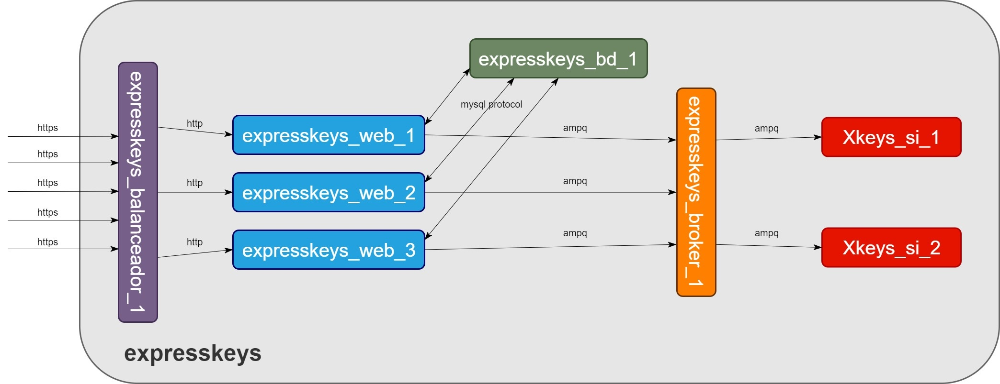
  
  
# Video explicativo de la página web
En este video se puede ver el perfecto funcionamiento y como se comporta la aplicación en ciertas situaciones forzadas como ejemplo. <br/> 
<p align="center">
[](https://youtu.be/K3_CQ9RSMkE)
