# Express Keys

# Descripción de la web 🌐
ExpressKeys consiste en una web de compra de "keys" de videojuegos para las diferentes plataformas online del mercado. En ella el cliente puede buscar los diferentes títulos disponibles utilizando diferentes herramientas como por ejemplo un sistema de filtrado por categorías, por precio, por plataforma online, etc... para posteriormente comprarlo y recibir su código para canjearlo.

# Entidades 🗯
 * Clientes: Usuarios del sistema que compran las keys en la página web.
 * Administradores: Usuario o usuarios que se encargan de añadir o eliminar productos del catalogo de la tienda.
 * Producto: Son las keys de los videojuegos que se muestran en la tienda y el usuario puede comprar.
 * Carrito de la compra: Los usuarios pueden añadir una o varias keys a una cesta de la compra antes de adquirirlas.
 * Valoraciones: Tras comprar una key un usuario puede dejar una puntuacion a la compra o revisar la valoración de otros productos,

# Parte pública 🔓
* Busqueda de videojuegos
* Filtrar catálogo
* Comprar keys
* Logearse/Registrarse 

# Parte privada 🔐
* Añadir/Eliminar productos del catalogo
* Dar de baja/alta a usuarios
* Consultar información de usuarios.

# Servicio interno 🖥
El servicio interno enviará un correo electrónico al usuario tras la compra de una key con los detalles de su pedido.

# Integrantes 👥 

* Sergio García Rosell [s.garciaro.2017@alumnos.urjc.es] https://github.com/SergioGr8
* Álvaro Barrio Luquero [a.barrio.2017@alumnos.urjc.es] https://github.com/alv4rob
* Nerfi Salim Perello [n.salim.2017@alumnos.urjc.es] https://github.com/nerf7

# Capturas de pantalla 
* Página principal: Como página principal, se muestra tanto el catálogo completo de productos junto a los filtros de búsqueda, además de los enlaces de registro e inicio de sesión, y el acceso al carrito. Como opciones exclusivas para los administradores, están el acceso a la lista de usuarios y la posibilidad de añadir un nuevo producto.

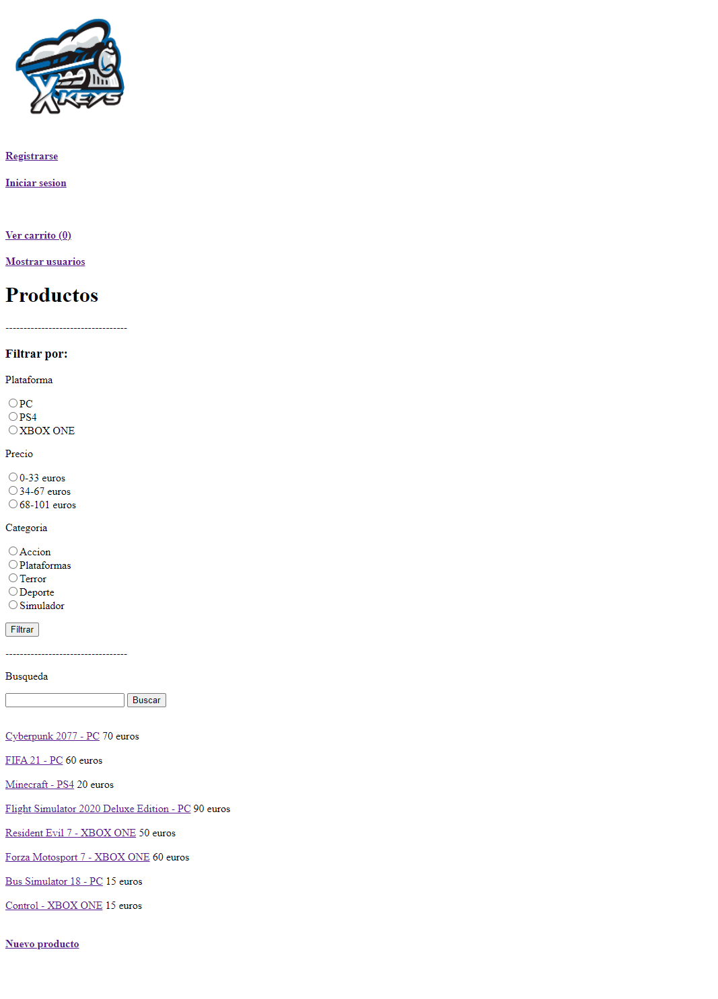
  
* Registro: La página de registro de usuarios incluye los campos para introducir un nombre de usuario, una contraseña y un correo electrónico, los campos que conforman a un usuario.

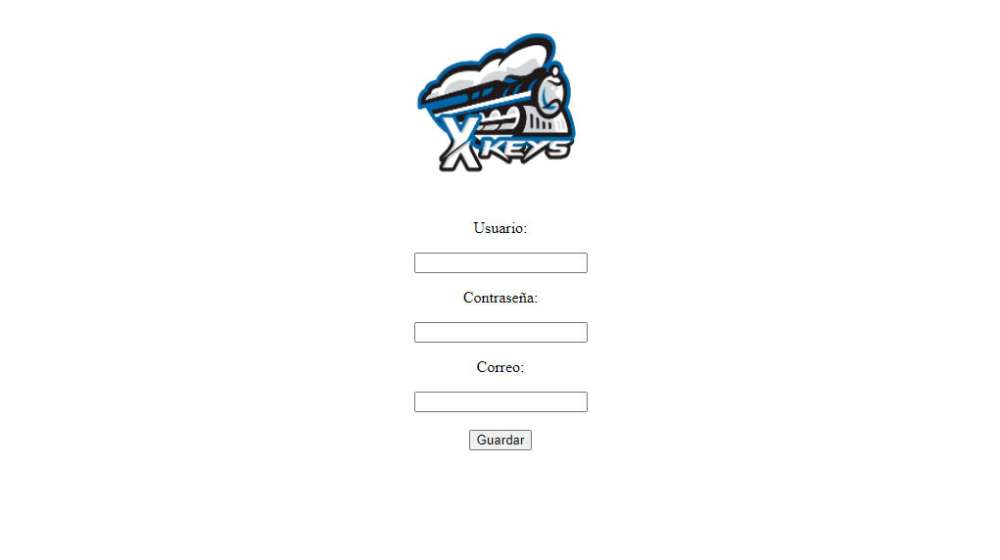

* Usuario registrado: Pantalla de aviso de que un nuevo usuario ha sido registrado. Lleva de vuelta a la Página principal.

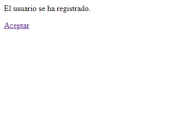
  
* Inicio de sesión: Se trata de la pantalla que recibe los datos de login de un usuario para que pueda iniciar sesión.

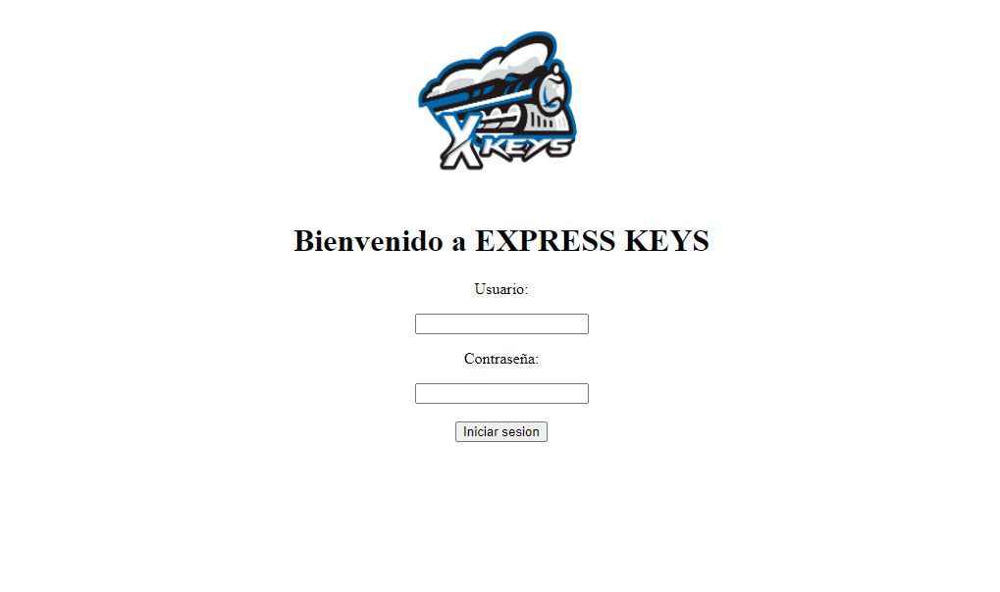
  
* Lista de usuarios: Como opción para los administradores, contiene la lista de los usuarios registrados actualmente. Permite acceder a la página de cada usuario o volver a la Página principal.

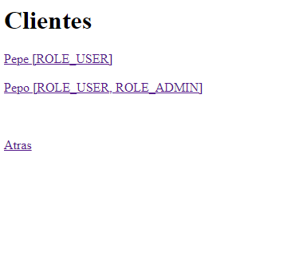
  
* Página de usuario: Muestra los datos de un usuario y da la opción de eliminarlo de la base de datos.

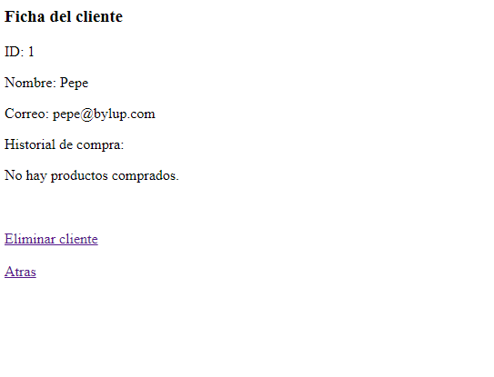
  
* Usuario eliminado: Pantalla de aviso de que un usuario ha sido eliminado. Lleva de vuelta a la Lista de usuarios.

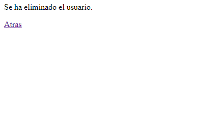
  
* Nuevo producto: Se trata de la página de inserción de usuarios al catálogo. Incluye los campos para introducir una lista de keys, un título, un precio, una plataforma y una categoría, los campos que conforman un producto.

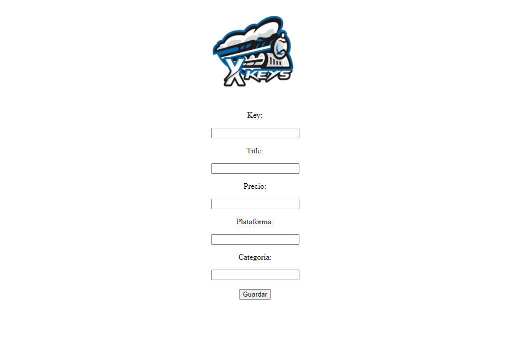
  
* Producto guardado: Pantalla de aviso de que un nuevo producto ha sido guardado en la base de datos. Lleva de vuelta a la Página principal.

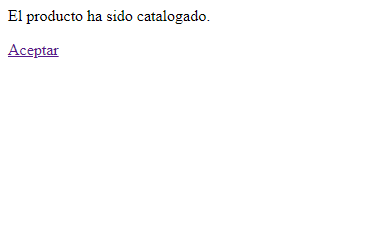
  
* Página de producto: Muestra la información de un producto y da la opción de añadirlo al carrito, dejar una valoración o volver a la página principal. Como opción para los administradores, está la posibilidad de eliminar el producto de la base de datos.

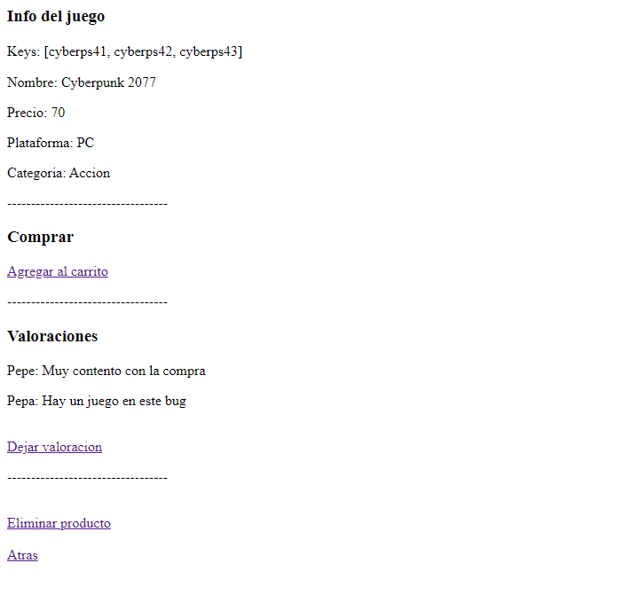
  
* Añadido al carrito: Pantalla de aviso de que un producto ha sido añadido al carrito. Lleva de vuelta a la Página principal.

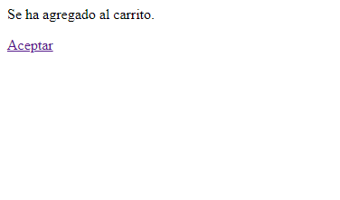
  
* No ñadido al carrito: Pantalla de aviso de que un producto no ha sido añadido al carrito. Lleva de vuelta a la Página principal.

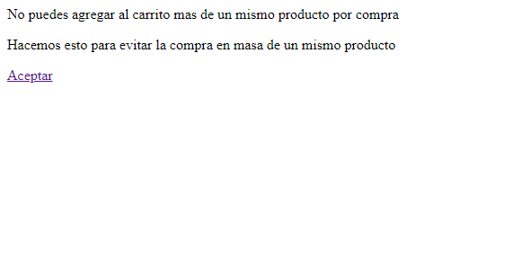

* Producto eliminado: Pantalla de aviso de que un producto ha sido eliminado de la base de datos. Lleva de vuelta a la Página principal.

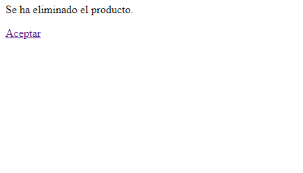
  
* Introducción de valoración: Pantalla en la que añadir el nombre y contenido de una valoración para un producto.

 

* Valoración enviada: Pantalla de aviso de que una valoración ha sido registrada. Lleva de vuelta a la Página de producto.

  
* Página del carrito: Pantalla que contiene los productos que se encuentran en el carrito en un momento dado junto a la suma total a pagar. Permite volver a la Página principal o acceder a comprar.

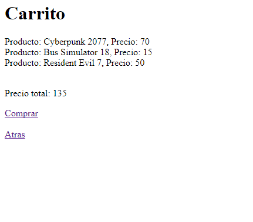
  
* Compra finalizada: Pantalla de aviso de que la compra ha sido completada. Se adjunta un recibo con los productos comprados y su key. Lleva de vuelta a la Página principal.

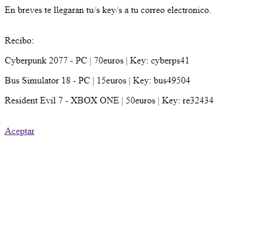
